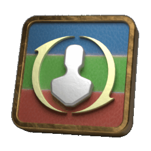

# [](https://archidog1998.github.io/RotationSolver/#/) **Rotation Solver**


The official relaunch of this plugin will be available at this link along with the release of the 7.0 :boat:Dawntrail :boat: expansion!

```
https://raw.githubusercontent.com/ArchiDog1998/DalamudPlugins/main/pluginmaster.json
```
[](https://discord.gg/9D4E8eZW5g)

> [! IMPORTANT]
>
> This plugin will not be fully open source, so the base library will not be fully public. 
>

For now there are two ways to get it:
- Try the community version of [Rotation Solver Reborn](https://github.com/FFXIV-CombatReborn/RotationSolverReborn) (not mine). 
- Build it by yourself from the release files.

On relaunch there will be 2 versions:

- Free edition (for most of the game)
- Supporter edition (which will have support for extra/endgame features)
	- Get it on [Patreon](https://www.patreon.com/ArchiDog1998) for a monthly subscription
	- Get it on [Ko-fi](https://ko-fi.com/s/7cf5ff0de3) for either a subscription


## Description

> Analyses combat information in every frame and finds the best possible action.

This means almost all the information available in one frame in combat, including the status of all players in the party, the status of any hostile targets, skill cooldowns, the MP and HP of characters, the location of characters, casting status of the hostile target, combo, combat duration, player level, etc.

Then, it will highlight the best action on the hot bar, or help you to click on it.

It is designed for `general combat`, and not optimized for savage or ultimate fights. Use it carefully in that type of content as it might need some manual input help.

## Compatibility

Literally, `Rotation Solver` helps you to choose the target and then click the action. So any plugin that changes any of these will affect its decision making capabilities. 

- [XIVCombo](https://github.com/daemitus/XIVComboPlugin)
- [ReAction](https://github.com/UnknownX7/ReAction)
- etc...

NOTICE: It can't be used with [`Block Targeting Treasure Hunt Enemies`](https://github.com/Caraxi/SimpleTweaksPlugin/blob/7e94915afa17ea873d48be2c469ebdaddd2e5200/Tweaks/TreasureHuntTargets.cs) in [Simple Tweaks](https://github.com/Caraxi/SimpleTweaksPlugin). 

I don't know why. I just used the [GetIsTargetable](https://github.com/aers/FFXIVClientStructs/blob/c554a586c4649a472433734b45c59a4bc4979ead/FFXIVClientStructs/FFXIV/Client/Game/Object/GameObject.cs#L71) Method in [FFXIVClientStructs](https://github.com/aers/FFXIVClientStructs). If anybody knows why, please tell me.

## Want to contribute?

- Create a fork
- Make your changes
- Test the changes
- Create a PR and point it to main

## How to build

- Change the dependency of `RotationSolver.Basic` to the nuget one.
- Build the whole solution!

## Links

If you have any questions about how to use Rotation Solver, please check the [Wiki](https://archidog1998.github.io/RotationSolver.Templates/#/) or read the wall of text on the [Discord](https://notavaliablefornow).

The rotation files are [here](https://github.com/ArchiDog1998/FFXIVRotations). If you want to, use them as a guideline, but please don't copy them, make your own rotation.

:pizza: Don't forget to chill out, have fun and enjoy the ride! :pizza:

[](https://crowdin.com/project/rotationsolver)

[](https://ko-fi.com/B0B0IN5DX)

[](https://www.patreon.com/ArchiDog1998)
