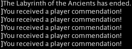

# 插件开发作者分析

我还是尽可能以`事实`+`推测`的方式来讲述我对各个作者的看法与理解。所以这个还算对事不对人嘛？不过这已经不再重要了。 

如果我没弄错的话，除了我以外的所有作者都是计算机相关专业的在读学生或在职人员。而我，是个艺术生？所以建筑算啥啊？工科生？不学高数线代还算工科嘛？

## 汐ベMoon

关键词：`关键人物`，`热情与激情`，`理念相冲`

如果说公开下载链接是此插件的第一个转折点，那么创建交流群无疑就是第二个转折点。（AA由Meow Corp（以下简称MC）维护就是第三个转折点）前者是因为此插件迎来了第三个用户，我懒得手动发送的结果，后者就是因为这位作者了。其表现出对此插件的极大的热情，并且让我知道了还有个插件叫`Sloth Combo`以及很多其他的第三方插件，而不止小小梦魇博客里的那些。虽然在当时，十分重视DPS的她已经让我知道了她大概率使用AA的目的不是日常副本而是高难（因为我那时日常打本平均已有两个赞了），但是作为第一个潜在的可能成为作者并进一步维护此插件还比我更了解战斗系统的人，我又怎舍得直接拒绝。所以就按照她的要求进行了插件的整改，并逐渐教授AA的设计逻辑。虽然我觉得让一个外行教内行很奇怪。

上图为现在的`Rotation Solver（以下简称RS）`第一次打团本获得的赞的数量。

作为一个在大学期间就授过课学生，我知道对于学生最为重要的就是热情与激情，但在这教育方面我也不专业，我也不知道该怎么培养与维持这种热情与激情。所以在某些已经和AA的设计理念相冲时，我选择了在一定程度上放弃了保持插件的统一性，而继续鼓励其进一步开发。现在看来，其实还是不应该在这个地方通融的。也正因为如此，再加上对于C# 语言的不熟练，她写大多数循环的最终效果并不理想，很大程度上只是在90级的高难副本中表现不错，但是其他情况或者配装未满足她的测试条件情况下的效果很不尽人意，还带来了大量的冗余代码。所以后来我的RS的玩家反馈群里问要先重写哪个循环的时候，前两个都是她写的循环。（民意让我不得不放弃7.0再写BLM的承诺）

尽管确实给我带来了不小的麻烦，但是热情与激情真的很重要。而且没有她，你们大多数人也很可能用不到如此开放的AA了。后来由MC接管之后，她好像就没啥工作了，所以我也不好评价了。

## 逆光

关键词：`完美`，`务实`，`表里不一`，`既爱又恨`

如果我没记错的话，第二个加入开发的，应该就是逆光了。在AA尚未归MC接管之前，我一直认为他是一个很追求完美的务实派。他第一个写的循环应该是`RPR`，尽管这不是我的主要职业，但是用起来确实非常好，而且几乎完美的符合了插件的定位。所以我当时一直很期待他能够自己慢慢的写完所有的职业，最让我省心的作者了。

但是后来，在一次为了解决奶妈上Dot的问题而误触到RPR的Dot(?)时，有一次联调。在那次，我感受到了藏在完美背后的一种自私，就是一种希望自己的循环能够写好，但是不在意别的循环的效果的自私。而这个问题，也让我意识到他很难写完所有职业，并不是因为时间，而是因为大局观。虽然我那个时候还是不能清楚地了解他具体的产品管理水平，但是能确定的是没有这样的大局观是很难做好一个产品的。所以后来的转接，我并没有想着给他来主导接手。

这里补充一句，任何人都不是完美的，或者说有能力偏向是很正常的，在一个团队中，要能尽可能发挥各个人员的长处就已经足够了。有短处，规避就好。也没必要要求这个人能往完美的方向发展。所以那件事情后，我就只希望他能好好写好自己想写的循环就可以了。

在AA由MC接管彻底让我失望后，他能重整旗鼓，接手接续写AA的行为属实超乎我的意料。虽然我认为他在管理整个产品上面能力不足，但是能力不足是可以逐渐培养的，有心才是关键。不过后来的事情啊，才是最有意思的。

在MC自行建群后，这个一直务实写循环的作者，突然画风一变，带头在各个方面说我的不好。虽然我早已不再在乎别人对我的评价了，但是这种出乎意料的体验还是独一无二的。 因为实际上我和逆光的接触非常少，除了PR就几乎不怎么说话，啥时候突然这么了解我了？而且在我的群里一直不愿明说，却在背后说坏话。建议步入职场后别这么干。

就这样，我想了想，也挺好，起码不用装了，心里会轻松些。那就好好黑我吧，不论是自己在我的屎山代码上接着改出自己的完美代码，还是就此别过，都挺好。然后后面的事情我又震惊了。他居然在看我的代码！而且一直在看！而且还关注我的动态！然后我就开始纳闷了。这到底是不喜欢我的东西，还是喜欢我的东西，还是不喜欢我的人品还是喜欢我的人品？为啥会这么关注我说了啥，我写了啥，我看到了啥。在群里说我不好，在背地里偷偷看呢？我甚至怀疑他很可能现在偷偷的在用我的RS，只是没有公开，当然这是猜测我没证据。

知道了我能看到他在群里说我的不好，为什么会如此愤慨，关心我看到的东西，然后在群里大面积踢人呢？（我为无辜者感到悲哀，这种行为有点不尊重群友啊）大概就是**久祁**说的**`新一任皇帝`**吧。感觉似乎又很在意我，就很奇怪。这大概就是既爱又恨吧。这实在是好素材！

补充一句，最好别这样八面玲珑了，这样会活得很累。

最后啊，别再说我什么盗取你们的循环代码不义了，你这是百步笑五十步。如果要说这个算盗取的话，我们可以算算量，一个循环不到300行，大约为整个插件的1/80的量，暂时不算之前我写的循环的影响下，姑且算我用了你们的全部职业的循环，20个，也就是算1/4个插件。现在全部的条件都是有利于你的，算我盗取了1/4个插件好吧。那么请问你Fork了多少国际服上的插件呢？[6个](https://github.com/NiGuangOwO/DalamudPlugins/tree/6846aeaa1bf9a2f65be2724ac38a130376632bb8/plugins)。看来应该是百步笑四步。更何况这本来就不能叫盗取啊，又不违反协议。而且既然用了我的代码，那肯定也是同意了GPL协议，允许自由分发与修改才是啊。

## Gamous

关键词：`实力超群`，`能力出众`，`有力无心`

这位应该是实力最强的人了。有着自己研发的插件，并且开发插件水平远在我之上。虽然没有写过任何职业的循环，但是为很多技术难题提供了解答。正是因为这些能力且有项目经验，我当时也认为，他是最有可能带领着AA进一步继续开发的。

但是很可惜，他对于产品的设计和认知上还是严重不足，这可能和缺乏大项目经验有关。并且明显无心想要进一步维护这个插件。从事后的情况上来看也是如此。所以我就断定了AA由MC接手后，肯定没有好的结局的，这也在一定程度上会想要入坑国际服。而从结果删库上也能印证我的观点。

## Ana Amari 

关键词：`老皇冠`，`负能量高手`

她应该是所有作者中游戏资历最深，并且也有计算机相关的经验。所以应当具有足够的实力与知识完成起码一个循环的书写。如果觉得框架不好，也应该有足够的能力进行修改。不过有意思的事情是，在我完全放开AA的开发到MC后就完全不写了，看来还是很需要我来主持开发的。

半年多的独自开发了，少一个开发者我倒是无所谓，但是却在线上反复说这个不好那个不好，却没有任何的建议。她的贡献，和我放弃维护国服插件有着非常巨大的关系。有时间吐槽，没时间更改，这大概就是慵懒吧。

## 其他

最后还有一些，贡献极少的开发者，或者在开发上扮演的职能比较低的，或者我不太了解的，就不在这里阐述了。要是有遗漏欢迎补充。

## 总结

所以这些

如果退一步出来看，这整件事情还是很有意思的。 