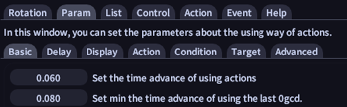

# FAQ

The most issues that appear when using RS are caused by incorrectly setting the addon. You have to customize the settings according to your Ping and to your Fps rate.

Starting off with the easiest to resolve issue, update your rotations in the Rotation – Info – Download top left corner icon button  

If you still have problems on the normal usage of RS representing that the skills are supported by the rotation but it doesn’t use them at all, it may be related to incorrect setting of these 2 parameters.

If you see it wanting to use a skill by making it glow using the teaching mode but then switches to another one before using it, the same 2 settings still might be the cause of your issue.

These are related to your fps, try starting with higher values and then dropping them a little at a time until you see there are no more issues happening. Also, if your FPS varies a lot try lowering some settings or other addons settings until you get quite a stable FPS rate.

 **Some normal values for these would be around 0.150, the advance of using actions always being lower than time advance of using the last oGCD.**

<u>**DO NOT USE VALUES BELOW 0.050 UNLESS YOU HAVE EXTREMELY HIGH FPS!**</u>

If you see it not even trying to use a skill then this setting this might be an issue.

This might cause an issue if it’s set too low or if your connection ping is bad/unstable. If you have a decently stable internet connection setting it to a too-high value causes no issues.

<u>**THE VALUE IS SET IN SEC, SO A 200 PING MEANS A 0.200 SETTING.**</u>

If you see incorrect order of skill usage using XIV Analysis it won’t always be the case of a rotation/RS issue. If your skill speed doesn’t allow using the skills in the proper order set on the rotation that should be one of the optimal ones, RS will skip it, use other skills, and then as it becomes available it will use it. During a long fight you will see this clearly as cooldowns will drift from the optimal rotation and burst windows will be increasingly weirder. Play around with the skill speed a bit and don’t use extreme skill speeds, either low or high, unless the rotation you’re using is made for that.

If you are using this for high-end content/parsing you are on your own, this is designed for general combat and normal-level content, it can be used but you will have to customize it yourself for that kind of usage.

**HAVE FUN!**
