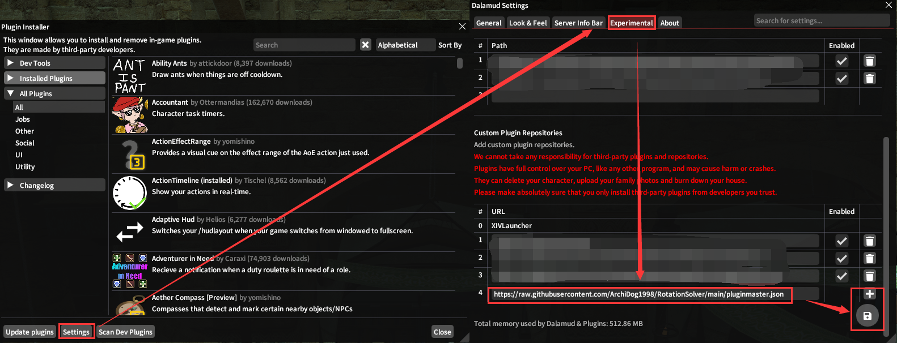
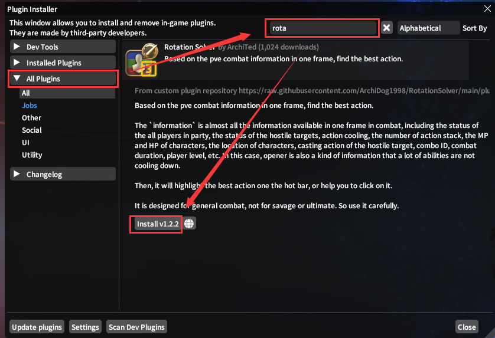
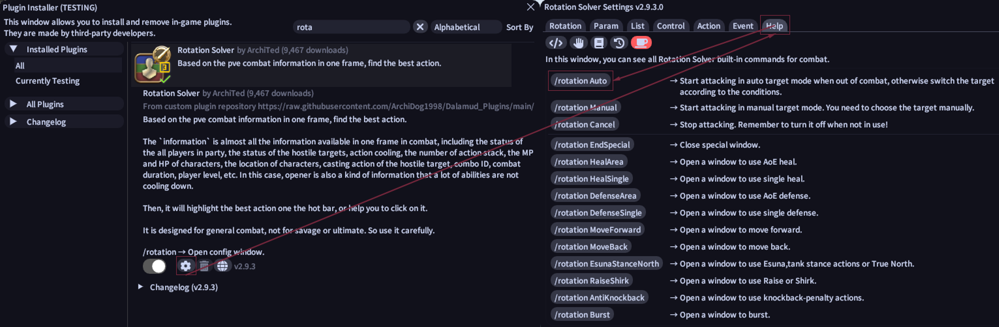

# RotationSolver⚔️

> Based on the pve combat information in one frame, find the best action.

The `information` is almost all the information available in one frame in combat, including the status of the all players in party, the status of the hostile targets, action cooling, the number of action stack, the MP and HP of characters, the location of characters, casting action of the hostile target, combo ID, combat duration, player level, etc. In this case, opener is also a kind of information that a lot of abilities are not cooling down.

Then, it will highlight the best action one the hot bar, or help you to click on it.

It is designed for `general combat`, not for savage or ultimate. So use it carefully.

## Installation

After installing [Dalamud](https://goatcorp.github.io/), input `/xlplugins` command to the chat box. Add go to`Settings` -> `Experimental` -> `Custom Plugin Repositories`, add url here. Finally, save it.

`https://raw.githubusercontent.com/ArchiDog1998/RotationSolver/main/pluginmaster.json`

Go back to the installer, Find the `Rotation Solver` in `All Plugins` Tab, and Install it.

## Quick Start

Open the `Rotation Solver Settings`, Find `Help` Tab, and left click the `/rotation Smart` to start the rotation. Then it is done.

What? Nothing happened? Fine. If your job is not a `Tank` role, Rotation Solver only attack the mobs that have target by default. So you need to right click the target into `Auto Attack` mode to make the target has a target which is your character. Then it is really done.
