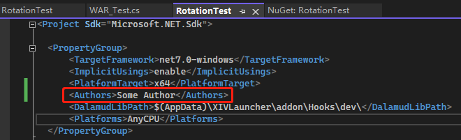

# Configurations

## Authors

Add yourself as an author for your project. It will be shown in-game.

## Easter Egg

You can find your hash ID in the debug tab. This is a `little easter egg`.  People will greet you, the developer, if you are in the same duty. 

Add your Hash ID to this attribute, and you are in!

If you don't want this, remove this file or don't put your hash in.

