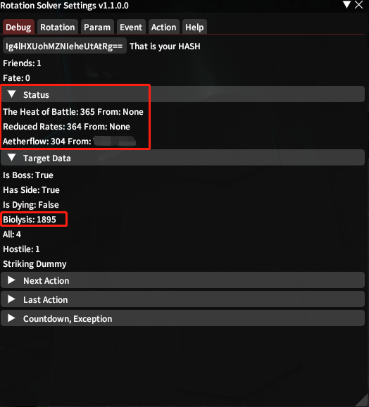

# Data Maintenance

Things above all is about the rotation. But some information from rotation needs maintenance too. It is also the rotation developer's work.

## ActionID

In order to maintenance this, I recommend a plugin called [SimpleTweaksPlugin](https://github.com/Caraxi/SimpleTweaksPlugin), which can help you to find the id easily.

Then modify the id in this [ActionID](https://github.com/ArchiDog1998/RotationSolver/blob/main/RotationSolver/Data/ActionID.cs) file in the right region.

## StatudID

When you use `Debug` mode to build this plugin, you'll see the tabitem like this, and it will show all the status.

Then modify the id in this [StatusID](https://github.com/ArchiDog1998/RotationSolver/blob/main/RotationSolver/Data/StatusID.cs) file.

## Action

All the action you used in rotation are defined in this [directory](https://github.com/ArchiDog1998/RotationSolver/tree/main/RotationSolver/Rotations/Basic). It is great to modify it for all rotation developers in this job. 

There are several parameters you need to know for constructor.

| Parameter        | Description                                             |
| ---------------- | ------------------------------------------------------- |
| isFriendly       | is a friendly or supporting action                      |
| shouldEndSpecial | end special after using it                              |
| isEot            | is hot or dot action                                    |
| isTimeline       | should I put it to the timeline (heal and defense only) |

Some Property you can set.

| Property      | Description                                                  |
| ------------- | ------------------------------------------------------------ |
| ComboIdsNot   | If combo id is on this list, this aciton will not used.      |
| ComboIds      | The combos that are not written on the action list.          |
| StatusProvide | If player has these statuses from player self, this aciton will not used. |
| StatusNeed    | If player doesn't have these statuses from player self, this aciton will not used. |
| ActionCheck   | Check for this action, but not for the rotation. It is some additional conditions for this action. |
| AOECount      | If this is an aoe action, how many hostile target would want to attack on, when you use this action. |

## FlagID

For melee job, some actions have positional. In order to make the position feedback right, we need to maintain one [table](https://github.com/ArchiDog1998/RotationSolver/blob/main/RotationSolver/Helpers/ConfigurationHelper.cs#L10). Please put the number in flytext when hitting the right positional on this table.
