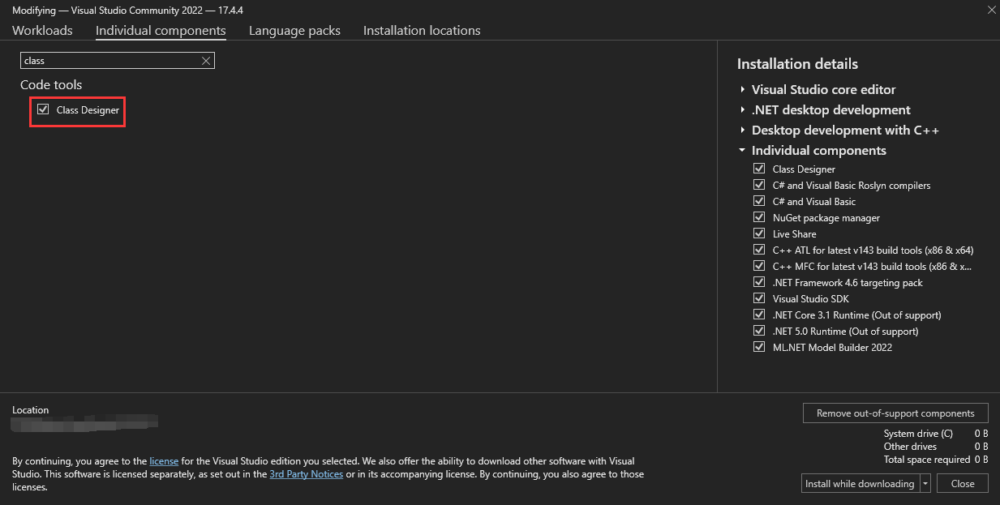
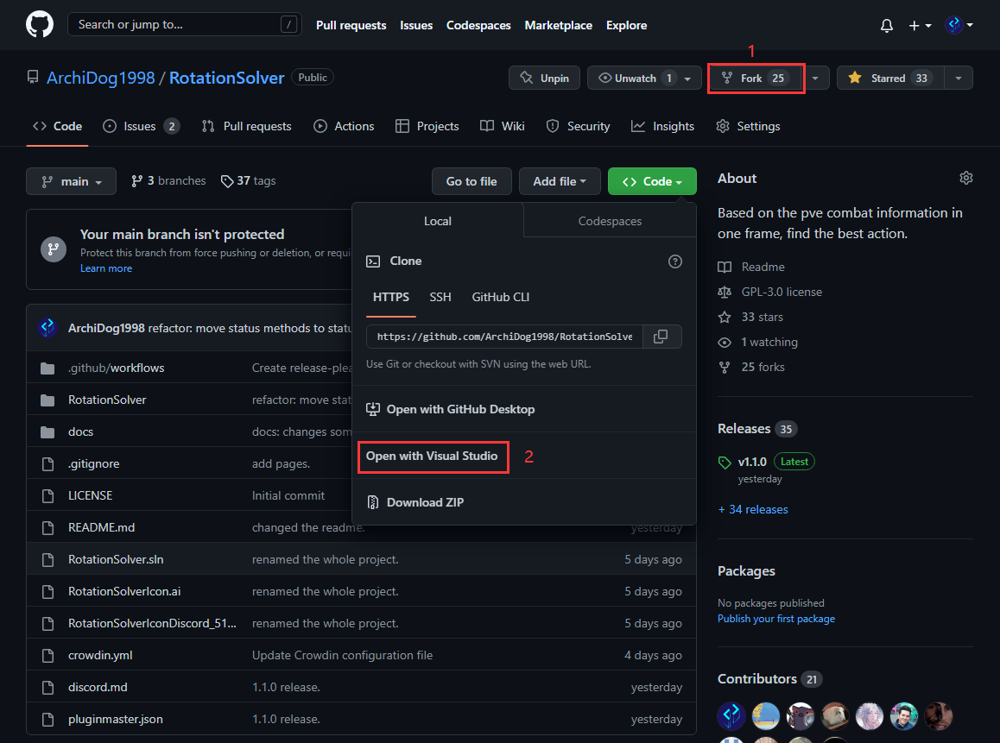
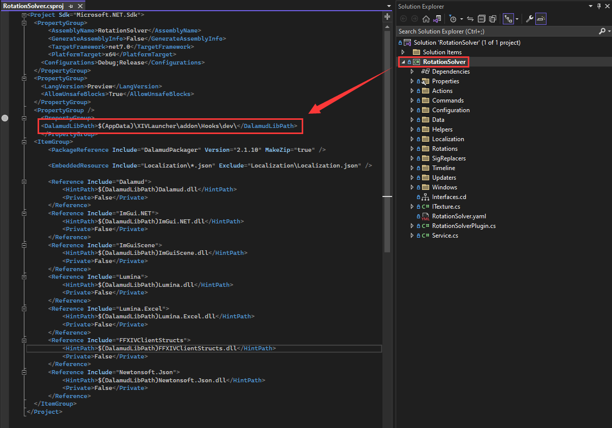
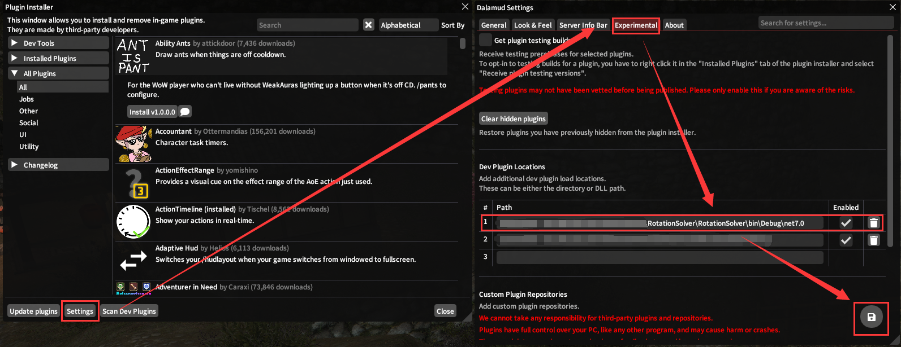
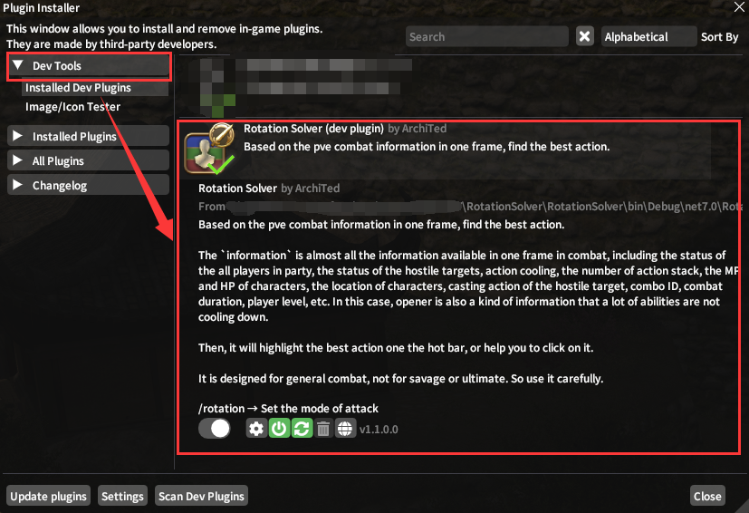

# Set Up

## Software

First you need to install the [Visual Studio](https://visualstudio.microsoft.com/). Please Check the `.NET desktop development`  under Workloads, `Class Designer` under Individual components.

## Repository

We use the fork workflow for rotation development. First you need to fork the [Rotation Solver](https://github.com/ArchiDog1998/RotationSolver) to your own repository. Then use Visual Studio to open it. Choose the directory to hold this solution.

## Configuration

Select the folder your `Dalamud` is in to the `DalamudLibPath`.

Build your own `dll`.

Go to the Game `FFXIV` and change the settings of dalamud. The path is under your directory set before.

NOTICE: before doing this, please disable or delete the version in release.

Then, under the Dev Tools, you'll see the plugins you built!

