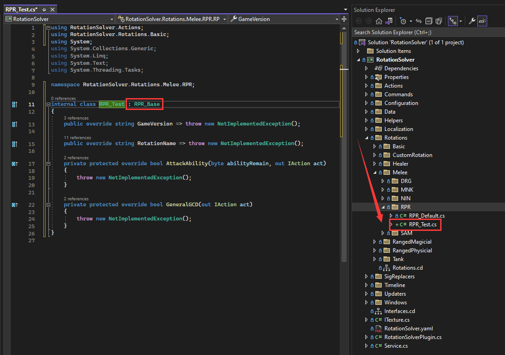
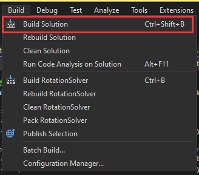
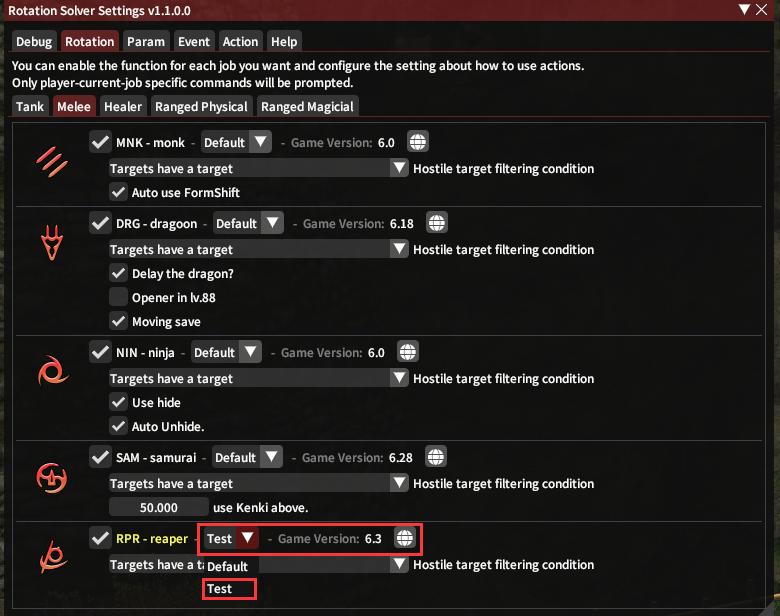
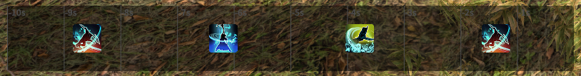
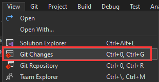
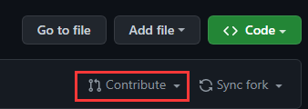

# Simple Rotation

After choosing the job to develop, you can write a simple rotation to test!

Please always add a new rotation for your own instead of modifying the rotation that is not created by you.

## Add a new rotation

Create a new rotation in the right job folder, and named it with `Job Abbreviation`\_`Rotation Name`, inherited from `Job Abbreviation`\_Base.

In this example, I create a rpr rotation named with `Test`.



Change the `GameVersion`  to the right game version. And Name it.

## Write A 123 Rotation

`Attack Ability` is for using the ability that can attack the mobs.

`General GCD` is similar to `Attack Ability` but is WeaponSkill or Spell.

So we need a rotation like `Slice` -> `WaxingSlice` -> `InfernalSlice`.

And we know that 3 need 2 to use, 2 need 1 to use. We write like 321.

```c#
using RotationSolver.Actions;
using RotationSolver.Rotations.Basic;

namespace RotationSolver.Rotations.Melee.RPR;

internal class RPR_Test : RPR_Base
{
    public override string GameVersion => "6.3";

    public override string RotationName => "Test";

    private protected override bool AttackAbility(byte abilityRemain, out IAction act)
    {
        act = null;
        return false;
    }

    private protected override bool GeneralGCD(out IAction act)
    {
        if (InfernalSlice.CanUse(out act)) return true;
        if (WaxingSlice.CanUse(out act)) return true;
        if (Slice.CanUse(out act)) return true;
        return false;
    }
}
```


We will discuss the Action in the future, so let's just do it.

## Rebuild the project

After finished the file adding. You need to build the project again. Somethimes, reuild maybe.



## Use your own rotation in Game

Let's go to the game and select your own rotation.



When you use `Smart` or `Manual`, the rotation will be like this.



## Commit

When you finished the rotation edit, please commit it. Open the `Git Changes` table and add some description on it.

We use [Conventional Commits](https://www.conventionalcommits.org/en/v1.0.0/) to write the commit. In thise case, commit should like this:

```
feat: rpr test created!
```



please do not use `!` to your rotation commit. Only use `feat`, `fix`,  `style` here.

Format like:  `Job Abbreviation` +`Rotation Name`+`Description`

After that,  `push` or `sync` your repository.


## Pull Request

If you want to make your own rotation to this plugin, you need to create a pull request to my repository.

you need to goto the github and find your repository and click contribute to pull request.



