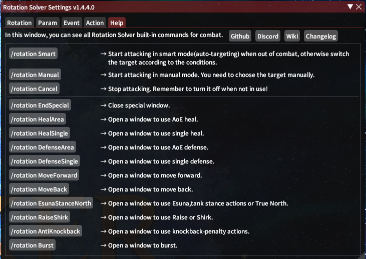

# Basic Settings

It is always good to know or control the `Rotation Solver`. So there are several tips for you.

## Repose

First of all, put a `Repose` Action to your hot bar which is shared. Rotation Solver will automatically replace `Repose` to what it want to use. It is like [XIV Combo](https://github.com/attickdoor/XivComboPlugin). And yes, it is XIVCombo that inspired me to create Rotation Solver.

## Macros

Click on the button on the `Help` is not efficiency. So you can right click on the button to copy the macro to your clipboard. And add a macro with this command or use [QolBar](https://github.com/UnknownX7/QoLBar).

There is a brief macro function description.

Macros are divided into two categories. One is for state, the other is for special duration.

### State

This kind of macro will set a no-time-limit state. It contains three macros.

| Macro            | Description                                                  |
| ---------------- | ------------------------------------------------------------ |
| /rotation Smart  | Start attacking in smart mode(auto-targeting) when out of combat, otherwise switch the target according to the conditions. |
| /rotation Manual | Start attacking in manual mode. You need to choose the target manually. |
| /rotation Cancel | Stop attacking. Remember to turn it off when not in use!     |

### Special Duration

This kind of macro will open a window for some special action to use. And the time is set here.

| Macro                      | Description                                                  |
| -------------------------- | ------------------------------------------------------------ |
| /rotation EndSpecial       | To end this special duration.                                |
| /rotation HealArea         | Open a window to use AoE heal.                               |
| /rotation HealSingle       | Open a window to use single heal.                            |
| /rotation DefenseArea      | Open a window to use AoE defense.                            |
| /rotation DefenseSingle    | Open a window to use single defense.                         |
| /rotation MoveForward      | Open a window to move forward.                               |
| /rotation MoveBack         | Open a window to move back.                                  |
| /rotation EsunaStanceNorth | Open a window to use Esuna,tank stance actions or True North. |
| /rotation RaiseShirk       | Open a window to use Raise or Shirk.                         |
| /rotation AntiKnockback    | Open a window to use knockback-penalty actions.              |
| /rotation Burst            | Open a window to burst.                                      |

