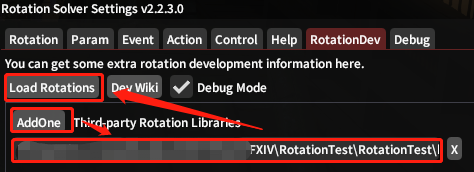

# Extra Rotations

If you want to add some extra rotations from other authors. 

First, you need to `Add One`.

Then, put the `folder` that contains your `dll` file to this input box.

By the way, you can add an download `url` here to auto update the rotation.

Last but not least, click `Load Rotations`.

It just like `dalamud`.