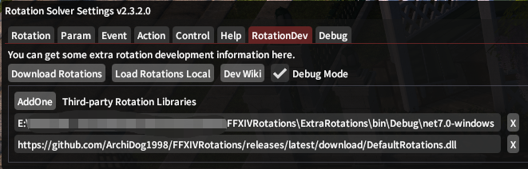

# Extra Rotations

In this panel, you can add third party dlls or your own dlls to the rotation solver.

## Add One

Use the `+` button to add a new rotation input line and you write the path to a `folder` that contains the `.dll` file or you add the URL link.

## Load

`Download` will download all rotations from the URLs you wrote, and then load them.

`Load Local` only load dlls from the local folder.

## Others

`Wiki/Help` see the wiki about rotations development in the browser.

`Auto load rotations` loads the rotations from the files/URLs you have set automatically.

