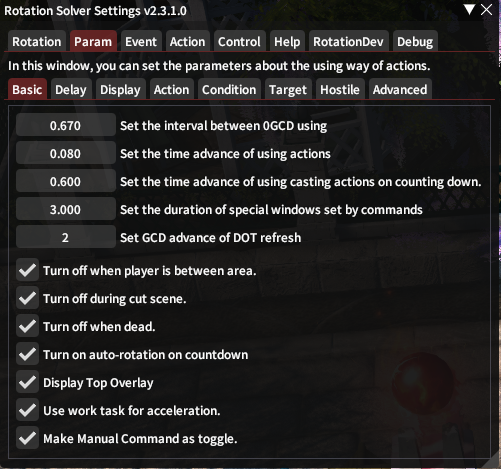
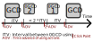

# Parameter Basic

In `Param` panel, we got some basic parameters to set.

## Click Things

This plugin helps you to click the right action during the combat.

These two parameters are very **important** for click. Some delayed GCD problems are mostly caused by these two parameters. Here is a diagram.

And there are two very important parameters you need to know.

`Interval between 0GCD using` determines how often to use a 0GCD, and how may 0GCDs are weaving into the GCD. The value of this parameter is related to the Ping value of the game. 0.6s - 0.7s are recommend.

`Time advance of using actions` is the amount of time in advance of using the actions. The value of this is related to your FPS of the game. Please set this value be little greater than the time of one frame. Based on this, the smaller the better.

## Time

`Time advance of using casting actions on counting down` is the amount of time in advance of using the actions when counting down finished.

`Duration of special windows set by commands ` is the amount of time of the special commands mentioned [here](basic-settings.md#Special Duration).

`GCD advance of Dot refresh` it the count of GCD advance before the target losing Dot status.

## Auto Turn on/off

`Auto turn off when player is between area` is an option for auto turning the plugin state to off when player is moving from one area to another.

`Auto turn off during cut scene` is an option for auto turning the plugin state to off when player is watching a cut scene.

`Auto turn off when dead` is an option for auto turning the plugin state to off when player is dead.

`Auto turn smart on countdown` is an option for auto turning the plugin state to smart when party counting down is active.

## Something Extra

`Display Top Overlay` is used to display some extra information on your game window, such as target's positional, target and sub-target, etc. It is recommended to turn this parameter on for more information.

`Use work task for acceleration` is an option for turning the work task on, which may improve the plugin operation efficiency, and bring some bugs (rare).

`Make Manual Command as toggle` is an option for making the Manual command to toggle between off and manual instead of turning the plugin state to manual.
