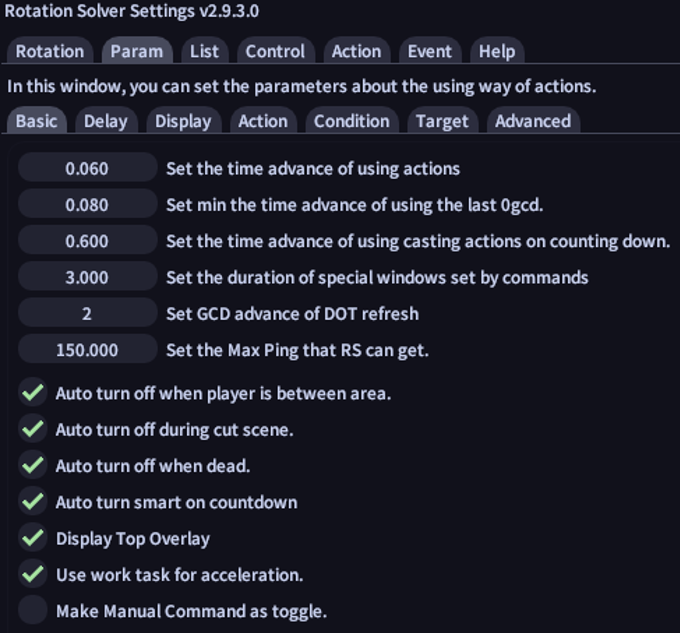
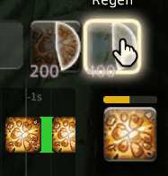
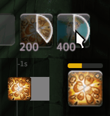

# Settings

In `Param` tab, there are the basic parameters to set.

## Click Things

This plugin helps you to use the right action during the combat. Here is a guide about the different options.

`Time advance of using actions` is the amount of time in advance of using the actions. The value of this is related to your in-game FPS. Please set this value to be greater than the time of one frame. If you want to simulate the intensive click, increase the value of this upping to 0.5s. But if the value is too high, it will be hard for you to manually use 0GCD actions between the regular use of actions. The recommended value is 0.1.

Left for 0.02s, right for 0.5s. Left is easier to click manually.

`Time advance of using last 0gcd` is the amount of time the last 0GCD is used before the next GCD is used. The recommended value is 0.12 but always higher than `Time advance of using actions`

## Time

`Time advance of using casting actions on counting down` is the amount of time in advance of using the actions before counting down finished. The recommended value is 0.6.

`Duration of special windows set by commands ` is the amount of time the special commands mentioned under the special duration category are active. The recommended value is 3.

`GCD advance of Dot refresh` is the number of GCDs any DoT actions are refreshed before the target is losing the DoT status. The recommended value is 2.

`Max Ping` RS can get the max ping after which RS reevaluates the next action. If the value is too low it can make RS clipping or if the value is too high and your ping is also very high it can make RS skip skills. The recommended value is a bit higher than how much your ping can get if it fluctuates.

## Auto Turn on/off

`Auto turn off when player is between area` is an option for auto turning the plugin off when the player is moving from one area to another.

`Auto turn off during cut scene` is an option for auto-turning the plugin state to off when the player is watching a cutscene.

`Auto turn off when dead` is an option for auto turning the plugin state to off when the player is dead.

`Auto turn smart on countdown` is an option for auto turning the plugin state to smart when party counting down is active.

## Something Extra

`Display Top Overlay` is used to display some extra information on your game window, such as target's positional, target and sub-target, etc. It is recommended to turn this parameter on for more information.

`Use work task for acceleration` is an option for turning the work task on, which may improve the plugin operation efficiency, and bring some bugs (rare).

`Make Manual Command as toggle` is an option for making the Manual command to toggle between off and manual instead of turning the plugin state to manual.
