# Parameters

`Param` panel contains a lot of parameters that can control the plugin.

## Delay

Almost all actions that RS do can be delayed for simulating human beings.

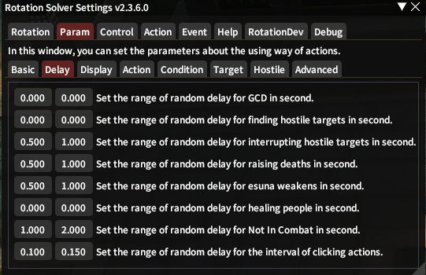

You can Delay `GCD`, finding `Hostiles`, `Hostiles can be interrupt`, `Death Party Members`, `Weaken Party Members`, `Healing`, `Not in Combat`, `Interval of clicking actions`.

## Display

`Display` panel contains a lot of thing that can show for you on the game ui. Some of options need [Overlay Window](param-basic.md#Something Extra) on.

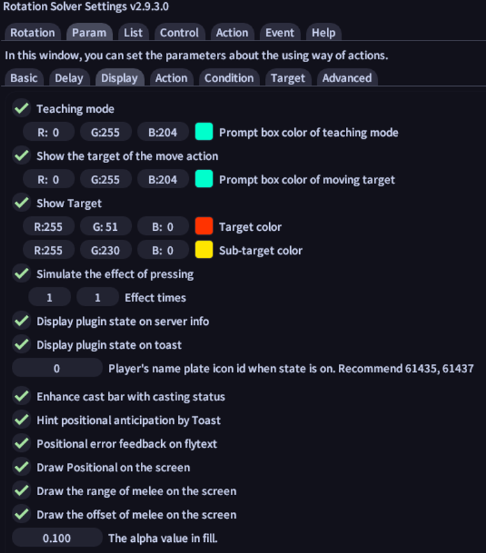

### Colored

`Teaching mode` can add a prompt box on your hot bar to teach you which action should be used next time. You can also change the color for it.

`Show the target of the move action` can show the moving target for you to know which target will be moved to.

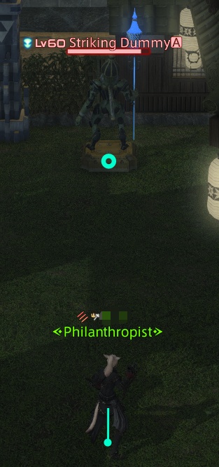

It can show the target of action and the sub targets (can be effected on) for you.

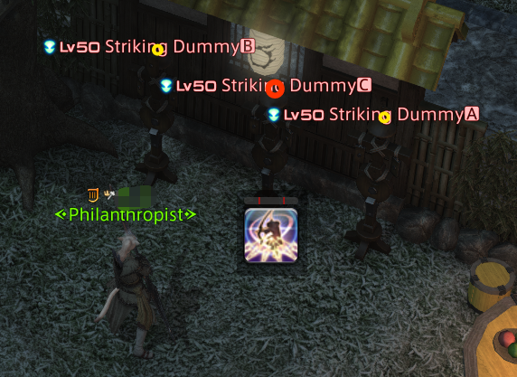

`Simulate the effect of pressing` can simulate the clicking effect on your hot bar for fun. You can make it more intense to change the times and interval.

### State

Plugin state can be displayed on `Server Info` or `Toast`

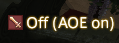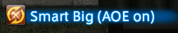

In order to know is `Smart` or `Manual` on, a name plate can be added to tell you whether it is on. You can change the icon id for displaying different icon. If you don't like set this value to `0`.

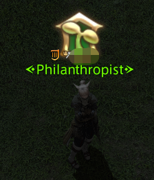

### Positional

You can show the Positional on Toast, and get feed back on flytext.

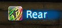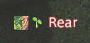

You can also draw `positional`, `range`  and `offset` on the overlay window.

If you are not in the right positional, it will display as green.

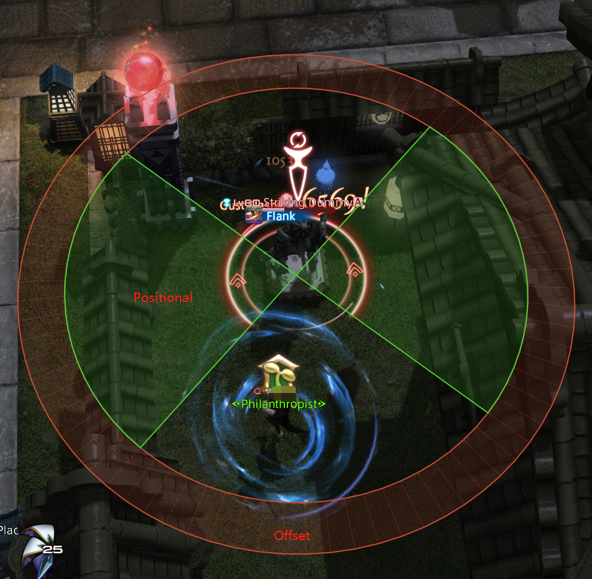

If you are in the positional, it shows white, and please don't leave this area.

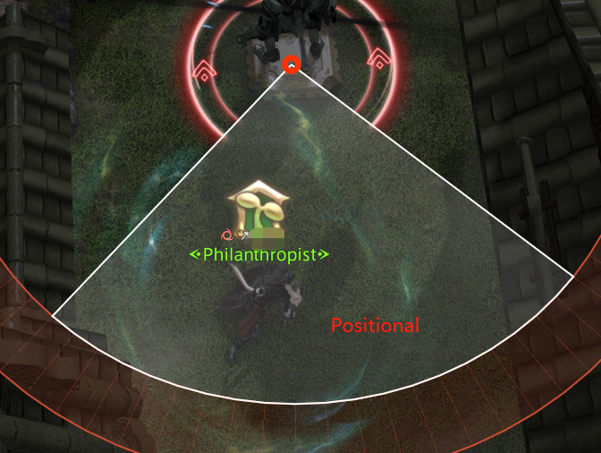

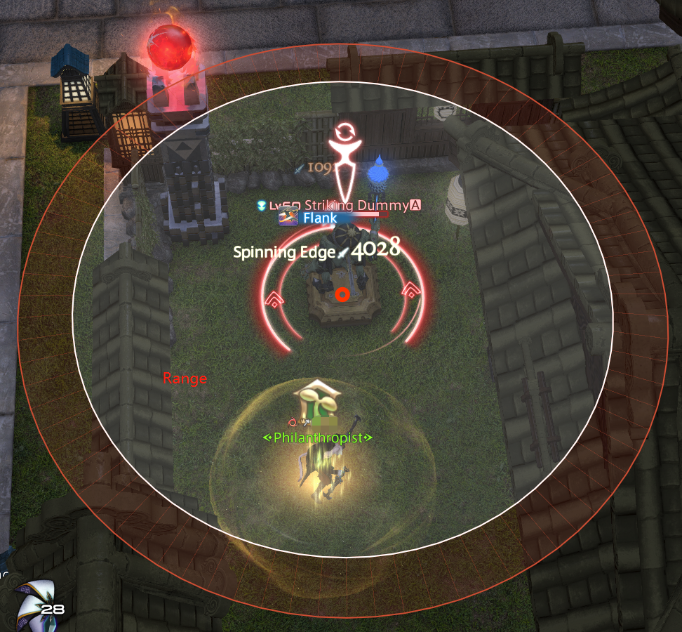