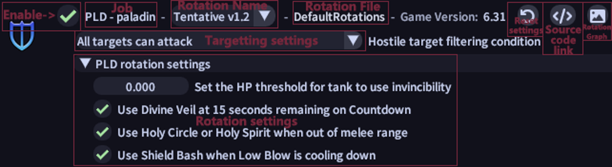
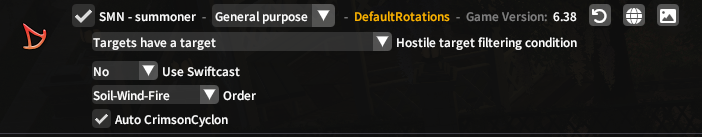
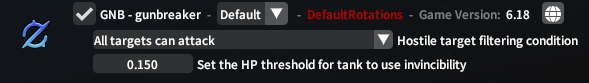
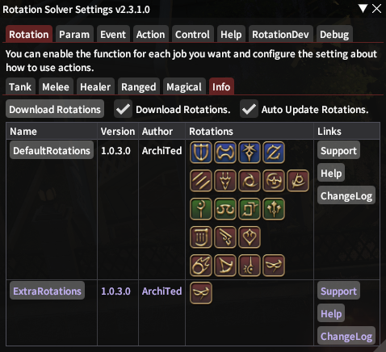

# Rotation Settings

In `Rotation` Panel, you'll see a lot of jobs to choose from.

The jobs are grouped by role in each individual tab, which consists of `Tank`, `Melee`, `Healer`, `Ranged`, `Magical,` and an extra general rotation tab `Info`.

## Jobs

On the first five panels, there are settings about the different jobs.

`Enable` is a toggle to choose whether or not you want to use RS on this class during combat.

`Job` is a text to show the job. If it has a yellow color that means you are doing this job right now.

`Rotation Name` shows the name of the rotation. You can choose another rotation from the ones you have downloaded if you want from the drop-down box.

`Rotation File` shows the file that this rotation belongs to. The color of this contains information about the status of the rotation.  Orange means `Beta`, purple means `Third-party`, and Red means `Invalid`.

`Game version` shows the game version for which this rotation was written.

`Reset Config` can reset the config of the `Specific Job`.

`Source Code Link` opens a web browser that links to the URL where the rotation author made it.

`Rotation Graph` is a picture or a link about this rotation.

`Targeting settings` is a drop box that contains the auto-targeting settings for the specific class.

`Rotation settings` is a set of configuration settings specific for each role as well as individual rotation settings set up by each author. You can use the specified macros to toggle some options while your job is selected.

`HP threshold for tank to use invincibility` is a trigger of using invincibility automatically. If the percent of HP of your character is lower than what you set here, it will automatically use the invincibility for you.

`HP threshold for healers to use different healing abilities` are the different party player HP thresholds that the individual healers use to cast different healing abilities.

## Info

`Info` contains all rotation files that you loaded into this plugin. It shows the `Name`, `Version`, `Author`, `Rotations`, and `Links` of each rotation file.

You can click on each rotation’s `Name` to show the file on your computer. Purple means that it is a third-party rotation.

`Download` is a force downloading for rotations. If your rotations didn't work well, please try to click on it.

`Download Rotations` is an option for downloading rotations, if you uncheck it, it'll not download any rotations for you. By default, the plugin does not contain any rotations, so please check it.

`Auto Update Rotations` is an option for auto-updating the rotations from their repositories for you.