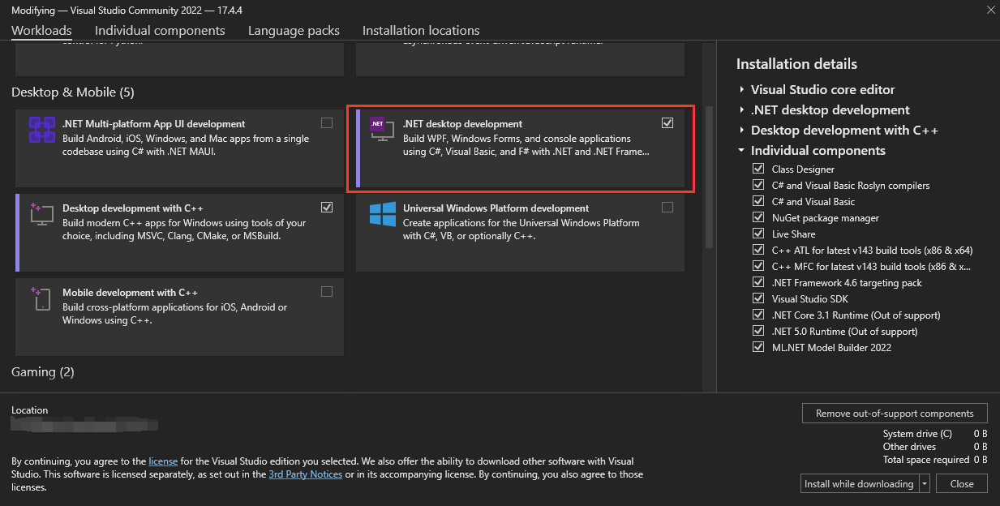
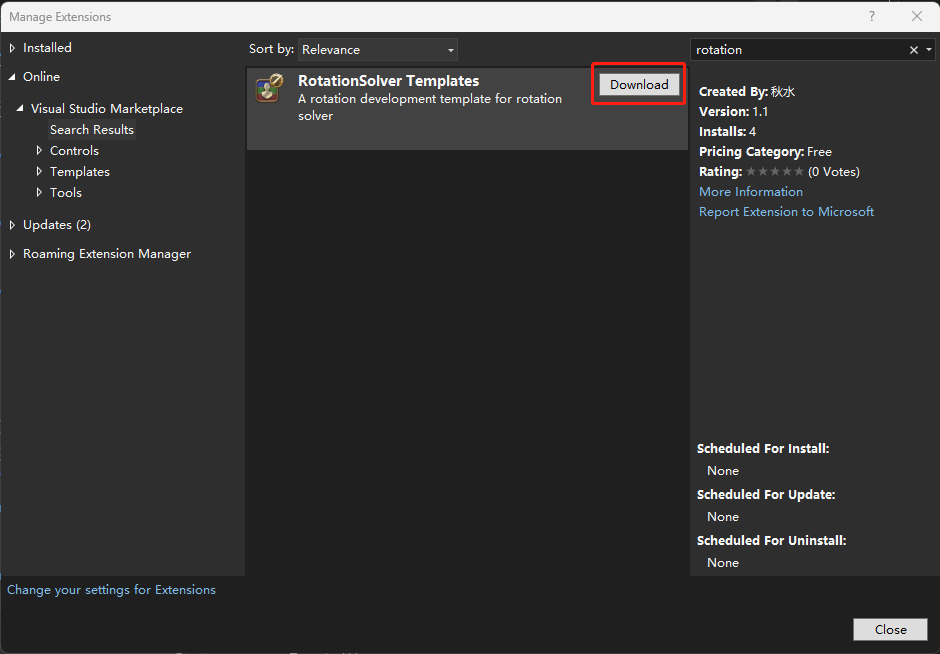
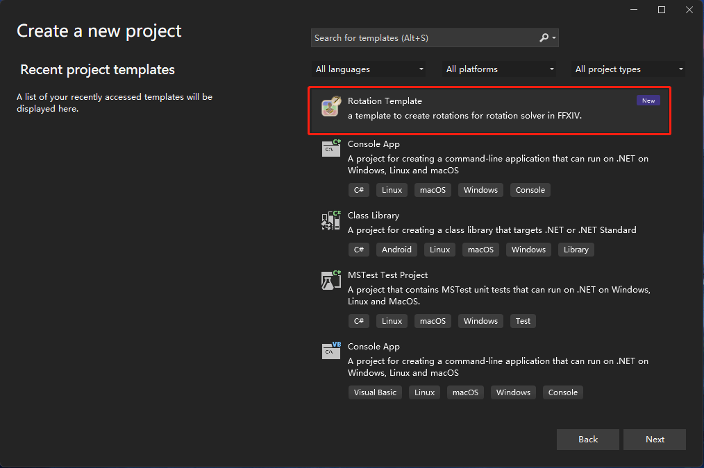
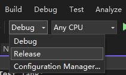

# Set Up

## Software

First you need to install the [Visual Studio](https://visualstudio.microsoft.com/). Please Check the `.NET desktop development`  under Workloads, `Class Designer` (optional)under Individual components.




## Project

Now, you need to add an extension for rotation develop. Download the `RotationSolver Templates` from `Manage Extensions`



Create a new project from the template and name it as what you want.



Update the Packages to the newest one.


Change the DalamudLibPath to your own.


## Rotation

Right click the role you want to add. And then add a new item.


Find the rotation template called `Simple Rotation`, and named it with `Job Abbreviation`\_`Rotation Name`. In this example, I create a WAR rotation and named with Test. So I call it WAR_Test.


And then, you'll see some thing like this.

``` c#
namespace RotationTest.Tank
{
    [LinkDescription("$Your link description here, it is better to link to a png! this attribute can be multiple! $")]
    [SourceCode("$If your rotation is open source, please write the link to this attribute! $")]
	[Rotation("WAR_Test", CombatType.PvE, GameVersion = "6.35")]
    // Change this base class to your job's base class. It is named like XXX_Base.
    public class WAR_Test : WarriorRotation
    {
        //GCD actions here.
        protected override bool GeneralGCD(out IAction? act)
        {
            throw new NotImplementedException();
        }

        //0GCD actions here.
        protected override bool AttackAbility(out IAction? act)
        {
            throw new NotImplementedException();
        }
    }
}
```


`Attack Ability` is for using the ability that can attack the mobs.

`General GCD` is similar to `Attack Ability` but is Weapon Skill or Spell.

So we need a rotation like `HeavySwing` -> `Maim` -> `StormsPath`/`StormsEye`.

And we know that 3 need 2 to use, 2 need 1 to use. We write like 321. And always put Effect of Time actions in front.

Let's just change some code like this, and you'll get a 123/4 rotation!

``` c#
namespace RotationTest.Tank;

[LinkDescription("$Your link description here, it is better to link to a png! this attribute can be multiple! $")]
[SourceCode("$If your rotation is open source, please write the link to this attribute! $")]
[Rotation("WAR_Test", CombatType.PvE, GameVersion = "6.35")]
// Change this base class to your job's base class. It is named like XXX_Base.
public class WAR_Test : WarriorRotation
{
    //GCD actions here.
    protected override bool GeneralGCD(out IAction? act)
    {
        if (StormsEyePvE.CanUse(out act)) return true;
        if (StormsPathPvE.CanUse(out act)) return true;
        if (MaimPvE.CanUse(out act)) return true;
        if (HeavySwingPvE.CanUse(out act)) return true;
        return false;
    }

    //0GCD actions here.
    protected override bool AttackAbility(out IAction? act)
    {
        act = null;
        return false;
    }
}
```

We will discuss the Action in the future, so let's just do it.

## To the Plugin

Change the Configuration from `Debug` to `Release` and then build it!



You'll see some output things in the Output, please copy the directory of this `dll`.


In the game, add this directory to your [Rotation Dev](extra-rotations.md) folder. After clicking the `Update rotations` button, you'll see your rotation!

## Use your own rotation in Game

Let's go to the game and select your own rotation.


When you use `Smart` or `Manual`, the rotation will be like this.


