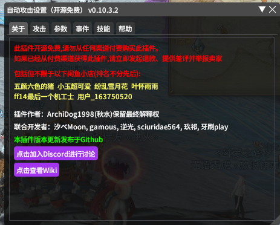
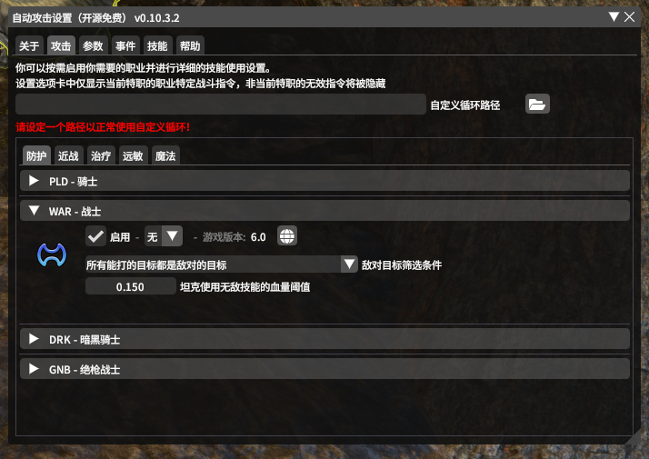
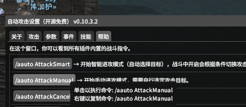
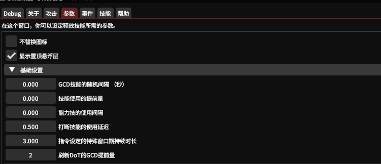
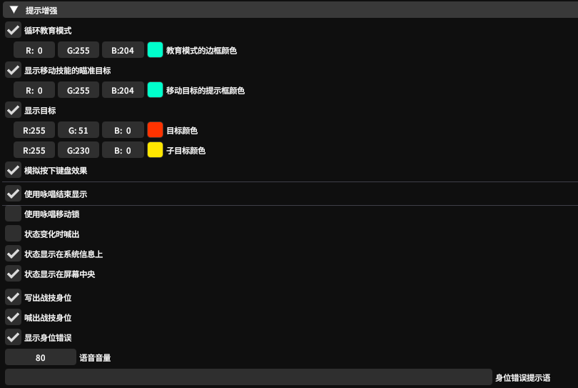
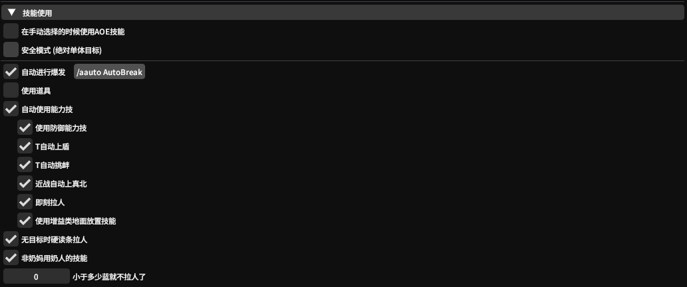
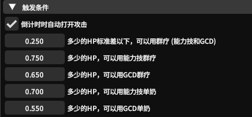
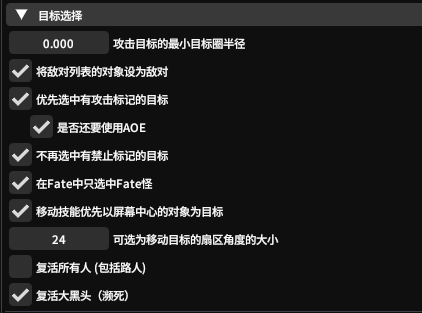
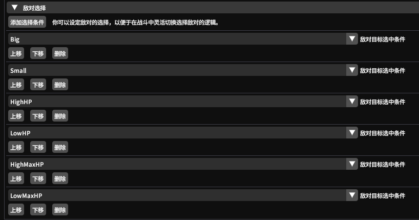

# XIV Auto Attack⚔️

本插件开源免费！请不要以【任何付费方式】获取本插件！
如果有不好用的地方或者循环不合理，或者某职业需要添加选项，请及时联系，谢谢！
QQ群：488744911


## 加载方法
设置中添加自定义插件仓库，安装
```
https://raw.githubusercontent.com/moewcorp/AutoAction/main/pluginmaster_CN.json
```

## 基础使用
游戏中输入```/pattack```打开设置界面，接下来你的各种设置都将在这里进行。


### 开启最简单的循环
进入到设置的【攻击】选项卡，找到你想要开启的职业，勾选启用。

然后找到一个木桩或其他目标，进入到设置界面的【帮助】选项卡，单击```/aauto AttackManual```来开启循环。```/aauto AttackSmart```来开启自动进行目标选择的循环。使用```/aauto AttackCancel```来结束本次循环。

你也可以右键单击该处来复制，或用宏或者[Qol bar](https://github.com/UnknownX7/QoLBar)来控制开启。
*注Qol bar在主库就有，你也可以从[这里](https://docs.qq.com/sheet/DVktrdlBiTVN6QlNx?tab=BB08J2)找到可爱的小宝贝AA手搓的现成Qolbar导入使用*



## 进阶使用
**参数设置窗口**

不替换图标：勾选后将图标自动显示为下一个技能

显示置顶悬浮窗：提前提示身位技能身位范围（建议勾选）



基础设置为GCD/能力技插入设置，可以根据自己的需要进行更改。

GCD技能的随机间隔：建议没有随机间隔（0.00）

技能提前使用量：默认0.08并不需要改动

能力技的使用间隔：因为在GCD中插入容易卡GCD,建议使用间隔在0.5-0.8之内（默认0.67）

打断技能使用延迟：同样推荐默认设置（0.500）

特殊指令的特殊窗口期持续时长：推荐默认设置（3.000）

刷新Dot的GCD提前量：建议2-3GCD，dot一般3秒一次判定2-3GCD比较合理（默认2GCD）

**技能增强窗口**



用于提示技能和目标信息的设置窗口。

循环教育模式是在自己的键位UI上进行提醒，当你用到什么技能时框出所用技能是什么。进行基础的循环记忆和练习。（当然技能必须在键位UI上才能进行提醒）

显示移动技能的瞄准目标/显示目标：在面向目标时范围圈显示小圆圈提示下个技能攻击的目标/子目标显示为附近可以选中的目标。

模拟按下键盘效果：顾名思义。

使用咏唱移动锁：勾选后咏唱技能强制在可滑步情况下才能位移，提供了热键来无视掉咏唱锁。

状态显示在系统信息上/状态显示在屏幕中央:在界面上出现提示UI

写出/喊出战技身位：身位提醒背和侧。显示身位错误：同理。

**技能使用窗口**



技能使用的自定义窗口

手动选择的时候使用AOE技能和安全模式：用来判断是否要使用AOE技能。

自动进行爆发： ```/aauto AutoBreak ``` 自动使用技能爆发而非手动使用 手动使用```/aauto Break```

使用道具：使用爆发药的单选框，目前尚未支持，待更新。

自动使用能力技：勾选需要使用的能力技（不同场景下使用）。

无目标时硬读条拉人/非奶妈用奶人的技能 ：救人用。提供少于多少蓝量不复活窗口。

**触发条件窗口**



倒计时时自动打开攻击：用于副本内的启动循环。

其他设置均为治疗触发判断，酌情修改。

**目标选择窗口**



选择目标判断窗口，根据自己需要进行修改。默认设置一般比较推荐。

**敌对选择窗口**



设定敌对选择判断逻辑

Big/Small 根据目标圈大小进行判断，适用于不同场景。

HighHP/LowHP/HighMaxHp/LowMaxHp 根据血量高低和目标血量最大值高低来判断，适用于大怪小怪血量判断。


## 自己写循环
当你对某个职业的输出逻辑不满意时，可以自己写一套循环设置。
